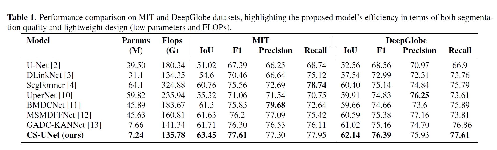
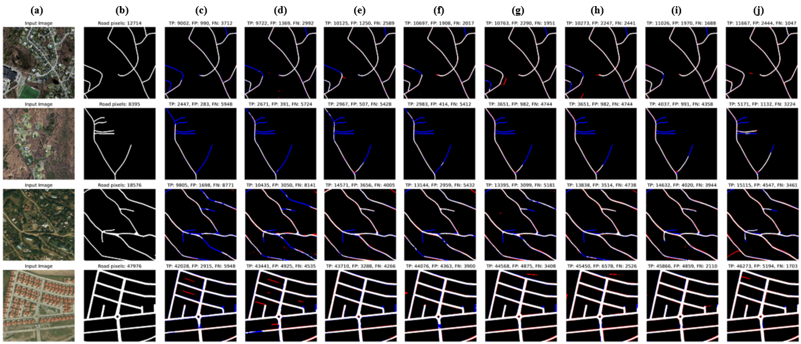
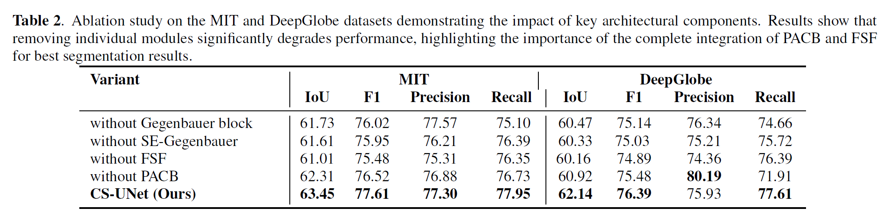
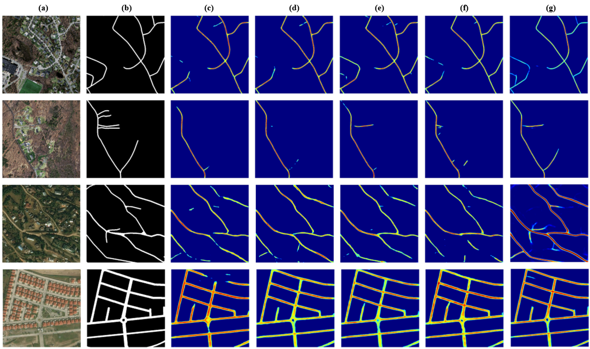

# CS-UNet

This repository contains code and models for **automatic road extraction** from satellite imagery using deep learning technique.

## 📌 Overview

The goal of this project is to perform **binary semantic segmentation** of roads from high-resolution satellite images. 

## System Configuration

All experiments and model training were conducted on a high-performance computing setup with the following specifications:

- **Operating System**: Ubuntu 20.04.6 LTS (Focal)
- **CPU**: AMD Ryzen 9 7950X (16 Cores, 32 Threads)
  - Base Clock: 3.0 GHz  
  - Boost Clock: Up to 5.88 GHz  
  - L3 Cache: 64 MB
- **RAM**: 128 GB DDR4
- **GPU**: NVIDIA RTX A6000
  - Memory: 48 GB GDDR6  
  - CUDA Version: 12.5  
  - Driver Version: 555.42.02
---
## Dataset Details

This project utilizes three benchmark datasets for road extraction from remote sensing imagery:

### 1. Massachusetts Roads Dataset (MIT)

- **Format**:
  - RGB images (`.tiff`)
  - Binary road masks (1 = road, 0 = background, `.tif`)
- **Resolution**: 1500 × 1500 pixels
- **Source**: [MIT](https://www.cs.toronto.edu/~vmnih/data/)

### 2. DeepGlobe Road Extraction Dataset (DG)

- **Format**:
  - RGB images (`.jpg`)
  - Binary road masks (1 = road, 0 = background, `.png`)
- **Resolution**: 1024 × 1024 pixels
- **Source**: [DG](https://ieeexplore.ieee.org/document/8575485)

---

## 🧪 Experimental Results

### 🔹 Model Comparison – Quantitative

<p align="center">
  
</p>

### 🔹 Model Comparison – Qualitative

<p align="center">
  
</p>

### 🔹 Ablation Study – Quantitative

<p align="center">
  
</p>

### 🔹 Ablation Study – Qualitative

<p align="center">
  
</p>

## Installation Guide (Using Conda)

```bash

# 1. Create the Conda environment
conda env create -f GADCKANNetenvironment.yml
conda activate tfclone

# 2. Run GADCKANNet-MIT.ipynb file using environment tfclone
